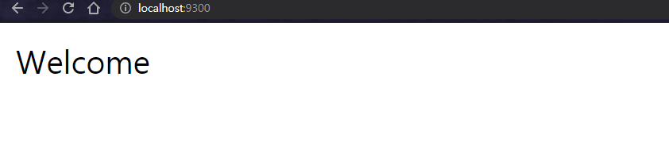
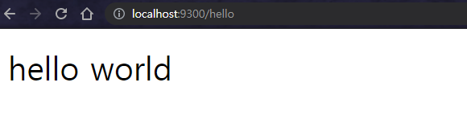

# 문제
1. AWS EC2를 생성하세요.
* type: t2.micro(free)
* region: Seoul
* subnet: AZ-a
2. AWS 쉘에 접속하세요.
3. openjdk 8을 설치하세요
4. git을 이용해서 프로젝트를 clone하세요.
```sh
git clone https://github.com/choisungwook/springboot-helloworld.git
```
5. maven을 설치하고 프로젝트를 빌드하세요
```sh
mvn package
```
5. 빌드 결과물인 .jar을 실행하세요.
6. 외부에서 "/"와 "/hello"를 접속해보세요. 성공적으로 접속한다면 아래 결과물이 나옵니다.





# 더 나아가기
1. 어떻게 웹페이지가 보이는 걸까? 그 과정은?
2. jar파일을 실행했는데 누가 어떻게 실행하는 것일까?
3. 처음에 웹페이지에 접속이 안되었는데 그이유는?
4. git clone과 download zip 차이는?